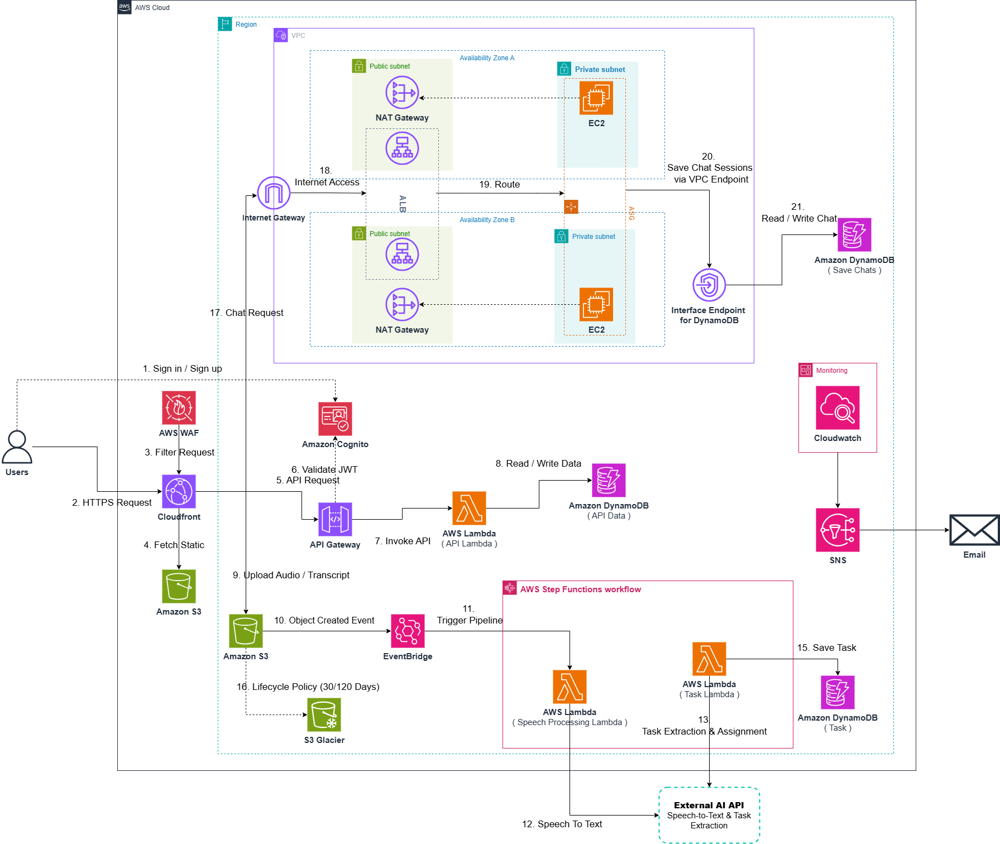

# AI Meeting Assistant Platform
## A Hybrid AWS Serverless + VPC Solution for Recorded Chat & Voice Meetings with Automated Task Assignment

### 1. Executive Summary
The AI Meeting Assistant Platform is a web application (Next.js Dashboard) that lets users hold recorded **Chat & Voice** meetings and automatically turns each session into actionable work. Audio and transcripts are uploaded to Amazon S3, which triggers an event-driven pipeline: a Speech Processing Lambda converts speech to text through an external AI API, and a Task Lambda extracts and assigns the resulting tasks, stores them in DynamoDB, and the team is notified. The system is deployed in the AWS **ap-southeast-1 (Singapore)** region and combines a serverless/managed layer for business APIs and the AI pipeline with a VPC + EC2 (Auto Scaling, 2 Availability Zones) layer for real-time Chat & Voice. It is designed for high availability, layered security, storage cost optimization, and centralized monitoring, serving an initial base of roughly 100 monthly active users (MAU).

### 2. Problem Statement
### What's the Problem?
Meeting notes and follow-up tasks are usually captured manually. Someone has to listen back to recordings, transcribe them, decide who does what, and then chase people to actually get the work assigned. This is slow, inconsistent, and easy to forget. Off-the-shelf meeting tools are either expensive, hard to customize, or don't tie transcription, task extraction, and assignment together in one flow, and few of them fit a small team.

### The Solution
The platform ingests all traffic through Amazon CloudFront (protected by AWS WAF) and routes API calls through Amazon API Gateway, which validates JWTs issued by Amazon Cognito before invoking business logic in an API Lambda backed by Amazon DynamoDB. Real-time Chat & Voice runs on Amazon EC2 inside a VPC across two Availability Zones, fronted by an Application Load Balancer and managed by an Auto Scaling group; chat sessions are written to a dedicated DynamoDB table through a VPC Interface Endpoint so traffic never leaves the AWS network. When a meeting's audio/transcript is uploaded to Amazon S3, an S3 event triggers Amazon EventBridge, which starts an AWS Step Functions workflow. Inside the workflow, a Speech Processing Lambda calls an external AI API for Speech-to-Text, and a Task Lambda calls the external AI API for task extraction and assignment, then saves the tasks to DynamoDB. Amazon SNS notifies users, older objects roll off to S3 Glacier on a lifecycle policy, and Amazon CloudWatch monitors the whole system. Key features include recorded meetings, automatic transcription, and automated task extraction and assignment.

### Benefits and Return on Investment
The platform removes the manual "listen, transcribe, split, assign, and chase" cycle, turning every recorded meeting into a tracked task list automatically. It gives the team a single place to run meetings and manage the work that comes out of them, improves consistency and traceability, and creates a searchable archive of meeting audio and transcripts for later reference. The hybrid design keeps costs predictable: the AWS infrastructure runs at **$152.47/month** ($1,829.64 for 12 months), and the AI model usage adds roughly **$37.33/month** at the recommended medium-usage scenario, for a combined **~$189.80/month** (~$2,277.54/year). Break-even depends on how many hours of manual meeting follow-up the team eliminates each month.

### 3. Solution Architecture
The platform is organized into service groups: Edge, Managed (outside the VPC), the VPC (real-time Chat & Voice), the AI Processing Pipeline (Step Functions, outside the VPC), and Monitoring. The end-to-end flow follows the numbered steps in the diagram: users sign in via Cognito and load the dashboard through CloudFront (WAF filtering, static assets from S3); API calls go through API Gateway to the API Lambda and DynamoDB; audio/transcripts are uploaded to S3, which drives the EventBridge → Step Functions → Speech Processing Lambda / Task Lambda → external AI pipeline, with tasks saved to DynamoDB; and real-time Chat & Voice is routed through the Internet Gateway to the ALB and EC2 instances (Auto Scaling across two AZs), with chats saved to a dedicated DynamoDB table via a VPC Interface Endpoint. CloudWatch and SNS handle monitoring and alerts. The architecture is detailed below:

### AWS Services Used
- **Amazon CloudFront**: CDN that distributes the Next.js dashboard and caches static content.
- **AWS WAF**: Filters malicious requests (SQLi, XSS, bots) at the edge.
- **Amazon S3**: Static web assets, uploaded audio/transcripts, and Glacier cold storage.
- **Amazon API Gateway**: Single entry point for all API traffic.
- **Amazon Cognito**: User authentication and JWT issuance/validation (~100 MAU).
- **AWS Lambda**: API Lambda for business logic, plus Speech Processing Lambda (STT) and Task Lambda (extraction/assignment) — three functions.
- **Amazon DynamoDB**: Business data (API Data), chat sessions (Save Chats), and extracted tasks (Task) — three tables.
- **Application Load Balancer**: Balances Chat & Voice traffic across two AZs.
- **Amazon EC2 + Auto Scaling**: Real-time Chat & Voice servers across two AZs, self-healing under load.
- **Amazon VPC (Internet Gateway, NAT Gateways, Interface Endpoint)**: Private networking, controlled egress (a NAT Gateway per AZ), and private DynamoDB access.
- **Amazon EventBridge**: Triggers the AI pipeline on the S3 "object created" event.
- **AWS Step Functions**: Orchestrates the Speech Processing and Task workflow.
- **External AI API**: Speech-to-Text and task extraction (e.g., Gemini / OpenAI / Claude).
- **Amazon SNS**: Notifications (email) and monitoring alarms.
- **Amazon CloudWatch**: Centralized logs, metrics, and alarms.

### Component Design
- **Edge**: CloudFront + WAF handle inbound HTTPS and serve static assets from S3.
- **Authentication**: Cognito issues JWTs (step 1); API Gateway validates them (step 6) before invoking Lambda.
- **Business API**: API Lambda reads/writes the API Data DynamoDB table (steps 7–8).
- **Upload**: Audio/transcripts are uploaded to S3 (step 9).
- **AI Pipeline**: An S3 object-created event → EventBridge → Step Functions (steps 10–11); the Speech Processing Lambda performs Speech-to-Text via the external AI API (step 12); the Task Lambda performs task extraction & assignment via the external AI API (step 13) and saves tasks to DynamoDB (step 15).
- **Real-time Chat & Voice**: Chat requests flow CloudFront → Internet Gateway → ALB → EC2 (Auto Scaling, steps 17–19); chats are saved to a dedicated DynamoDB table through the Interface Endpoint (steps 20–21).
- **Storage Lifecycle**: Objects transition to S3 Glacier on a 30/120-day policy (step 16).
- **Monitoring**: CloudWatch collects logs/metrics/alarms and raises alerts via SNS (email).

### 4. Technical Implementation
**Implementation Phases**
This project is delivered in four phases:
- Build Theory and Draw Architecture: Research the hybrid serverless + VPC design and the AI pipeline, and produce the architecture diagram (planning phase).
- Calculate Price and Check Practicality: Use the AWS Pricing Calculator and estimate AI (token) costs; validate feasibility against the target ~100 MAU (Month 1).
- Fix Architecture for Cost or Solution Fit: Tune the design — e.g., NAT/endpoint layout, S3 lifecycle, batching and caching for AI calls — to stay cost-effective (Month 2).
- Develop, Test, and Deploy: Build the Next.js app, the EC2 Chat & Voice service, and the AWS services via CDK/SDK, then test and release to production (Months 2–3).

**Technical Requirements**
- Frontend & API: Practical knowledge of Next.js (hosted via CloudFront/S3), API Gateway, Cognito (JWT), and Lambda + DynamoDB for business logic.
- Real-time layer: EC2 within a VPC across two AZs, an Application Load Balancer, an Auto Scaling group, NAT Gateways for controlled egress, and a VPC Interface Endpoint for private DynamoDB access.
- AI pipeline: S3 event notifications, EventBridge, Step Functions, a Speech Processing Lambda (STT) and a Task Lambda (extraction/assignment) calling an external AI API, plus SNS for notifications.
- Integration: AWS CDK/SDK to provision and wire services, and S3 lifecycle policies for cost control.

### 5. Timeline & Milestones
**Project Timeline**
- Planning (Month 0): Research the design, draw the architecture, and confirm the service list.
- Implementation (Months 1–3):
    - Month 1: Set up accounts/region (ap-southeast-1), study services, and confirm cost estimates.
    - Month 2: Build and adjust the architecture (VPC/EC2, serverless API, AI pipeline).
    - Month 3: Implement, test end-to-end, and launch.
- Post-Launch: Ongoing operation, monitoring, and tuning.

### 6. Budget Estimation
You can view the full estimate on the [AWS Pricing Calculator](https://calculator.aws/) or download the [Budget Estimation File](../attachments/Cost.pdf). AI model costs are detailed in the accompanying Gemini 2.5 Flash estimate.

### Infrastructure Costs (AWS, ap-southeast-1)
- Amazon EC2 (t3.medium, 1 instance, 30 GB EBS): $41.82/month.
- Amazon VPC (NAT Gateways + public IPv4): $49.67/month.
- Elastic Load Balancing (1 ALB): $19.20/month.
- Amazon CloudWatch (logs, metrics, alarms, 1 dashboard): $19.05/month.
- AWS WAF (1 Web ACL, 5 rules + 1 managed group): $11.60/month.
- Amazon DynamoDB (API Data + Task + Save Chats): $4.76/month.
- Amazon CloudFront (~20 GB out, 1M requests): $3.66/month.
- Amazon API Gateway: $1.25/month.
- Amazon S3 (Frontend + Audio + Glacier): $1.28/month.
- Amazon SNS: $0.18/month.
- AWS Lambda (3 functions), Amazon Cognito (100 MAU), AWS Step Functions: $0.00/month.

Subtotal (AWS): **$152.47/month, $1,829.64/12 months.**

### AI Model Costs (Gemini 2.5 Flash, estimated)
Covers the external AI-API calls in the pipeline (Speech-to-Text and task extraction):
- Low usage: ~$15.53/month.
- Medium usage (recommended baseline): ~$37.33/month.
- High usage: ~$96.53/month.

### Combined Total (recommended medium scenario)
- Monthly: ~$189.80 (AWS $152.47 + AI $37.33).
- 12 months: ~$2,277.54.

### 7. Risk Assessment
#### Risk Matrix
- AZ or EC2 failure (Chat & Voice interruption): High impact, low probability.
- AI cost overruns (long outputs / heavy audio): Medium impact, medium probability.
- Security incidents (malicious traffic, credential abuse): High impact, low probability.
- External AI API outage: Medium impact, low probability.

#### Mitigation Strategies
- Availability: Multi-AZ VPC, ALB + Auto Scaling with self-healing EC2, and a NAT Gateway per AZ.
- AI cost: Cap max output tokens, use batch API and context caching, and consider Flash-Lite for simple tasks.
- Security: WAF at the edge, Cognito/JWT authorization, EC2 in private subnets, and a VPC Endpoint so DynamoDB traffic stays off the internet.
- Dependencies: Retry/backoff and dead-letter handling in Step Functions for external AI calls.

#### Contingency Plans
- Fall back to manual note-taking if the AI pipeline is unavailable, then reprocess uploads later.
- Use S3 lifecycle and CloudWatch budget alarms to control storage and cost.
- Re-drive Step Functions executions to reprocess failed audio/transcript uploads.

### 8. Expected Outcomes
#### Technical Improvements
Recorded meetings are transcribed and turned into assigned tasks automatically, replacing manual follow-up. The real-time layer stays available across two AZs, and the serverless pipeline scales with usage.
#### Long-term Value
A searchable archive of meeting audio, transcripts, and extracted tasks, plus a reusable hybrid architecture pattern (serverless + VPC) that can grow with the team.
