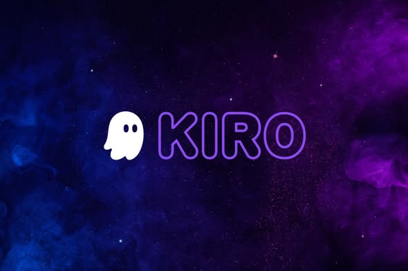
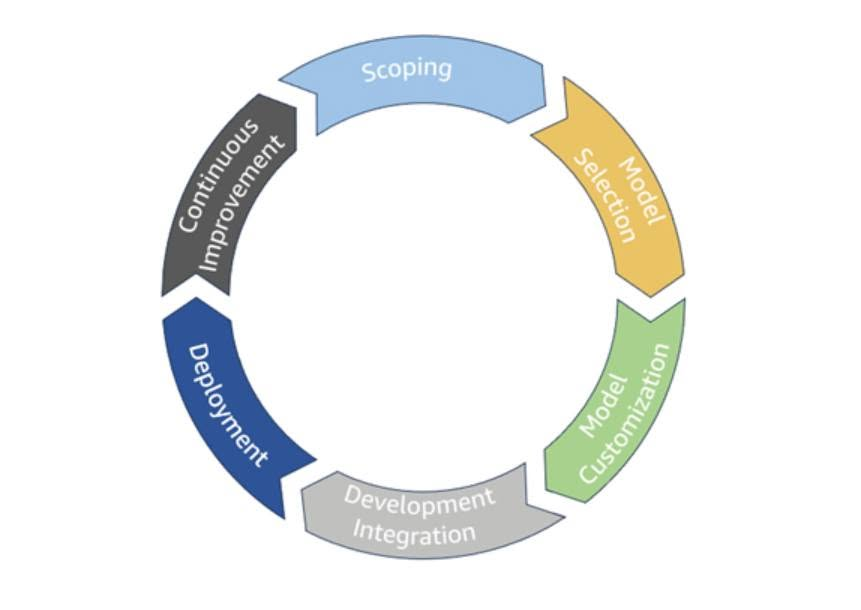
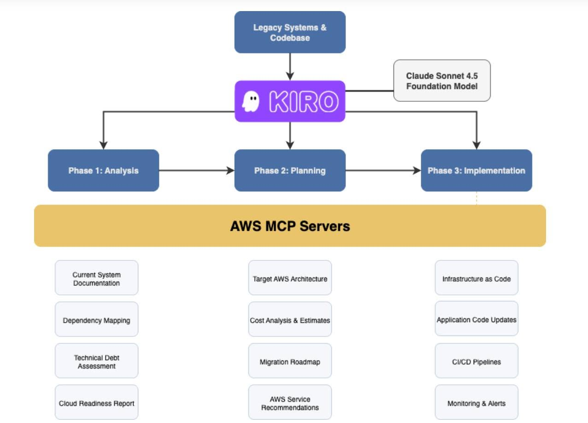

## KIRO – AI Coding Assistant của AWS và xu hướng AI-assisted development lifecycle

Chào anh em AWS Study Group VN!

Thời gian gần đây, AI Coding Assistant đang trở thành một xu hướng rất mạnh trong phát triển phần mềm. Nếu trước đây lập trình viên chủ yếu dùng AI để gợi ý code, fix bug hoặc giải thích lỗi, thì hiện nay AI đang dần tham gia sâu hơn vào toàn bộ vòng đời phát triển phần mềm: từ phân tích yêu cầu, thiết kế, viết code, tạo test cho đến tối ưu năng suất làm việc nhóm.

Dựa trên AWS Architecture Blog về bản cập nhật AWS Well-Architected Machine Learning Lens, AWS đã nhắc đến một hướng tiếp cận mới là AI-assisted development lifecycle, bao gồm code generation và productivity enhancement thông qua các công cụ như Kiro và Amazon Q Developer.

Trong bài viết này, nhóm mình muốn chia sẻ ngắn gọn về Kiro – một công cụ AI Coding Assistant của AWS, nhưng không chỉ nhìn nó như "AI viết code", mà nhìn dưới góc độ một công cụ hỗ trợ quy trình phát triển phần mềm bài bản hơn.

### Kiro là gì?

Kiro là một AI IDE / Coding Assistant của AWS, được thiết kế để hỗ trợ lập trình viên phát triển phần mềm theo hướng có cấu trúc hơn.

Thay vì chỉ nhập prompt rồi nhận code ngay, Kiro hướng người dùng đi theo quy trình **Spec-Driven Development**, tức là phát triển phần mềm dựa trên đặc tả.

Nói đơn giản, trước khi viết code, Kiro có thể giúp lập trình viên làm rõ:

- Chức năng này cần giải quyết vấn đề gì?
- Người dùng sẽ sử dụng chức năng như thế nào?
- Yêu cầu cụ thể gồm những gì?
- Thiết kế kỹ thuật nên chia ra sao?
- Cần những task nào để triển khai?
- Cần kiểm thử những trường hợp nào?

Điểm này khá quan trọng, vì trong thực tế nhiều dự án không thất bại vì thiếu code, mà thất bại vì yêu cầu mơ hồ, thiết kế thiếu rõ ràng và team không thống nhất cách triển khai.

### Spec-Driven Development – không code vội, phân tích trước

Điểm đáng chú ý nhất của Kiro là Spec-Driven Development.

Với cách làm thông thường, nhiều người dùng AI theo kiểu: *"Làm giúp tôi chức năng đăng nhập."* Sau đó AI sinh ra code, rồi mình chạy thử, lỗi thì sửa tiếp. Cách này nhanh, nhưng nếu dự án lớn hơn thì rất dễ rối vì AI có thể tự suy đoán logic, tạo thêm file không cần thiết hoặc làm lệch yêu cầu ban đầu.

Với Kiro, quy trình hợp lý hơn sẽ là:

1. Mô tả ý tưởng hoặc tính năng.
2. Tạo yêu cầu chi tiết.
3. Tạo thiết kế kỹ thuật.
4. Chia nhỏ thành từng task.
5. Review lại spec.
6. Sau đó mới triển khai code.

Ví dụ với chức năng đăng nhập, thay vì chỉ yêu cầu AI code ngay, ta có thể để Kiro phân tích trước:

- Người dùng nhập email và mật khẩu.
- Hệ thống validate dữ liệu đầu vào.
- Nếu sai thông tin thì hiển thị lỗi.
- Nếu đúng thì tạo phiên đăng nhập hoặc token.
- Route riêng tư chỉ cho phép user đã đăng nhập truy cập.
- Cần test các trường hợp thành công, thất bại và thiếu dữ liệu.

Nhờ vậy, AI không còn làm việc dựa trên prompt quá ngắn, mà dựa trên đặc tả rõ ràng hơn.

### Kiro trong AI-assisted development lifecycle

Theo AWS Architecture Blog, AWS Well-Architected Machine Learning Lens đã cập nhật thêm nội dung liên quan đến AI-assisted development lifecycle, trong đó có code generation và productivity enhancement với Kiro và Amazon Q Developer.

Điều này cho thấy AWS không xem AI Coding Assistant chỉ là công cụ "gợi ý code", mà là một phần trong vòng đời phát triển phần mềm hiện đại. Có thể hình dung Kiro hỗ trợ ở nhiều giai đoạn khác nhau như dưới đây.

#### Phân tích yêu cầu

Kiro giúp chuyển một ý tưởng còn mơ hồ thành yêu cầu rõ ràng hơn. Ví dụ với một dự án "AI Meeting & Workforce Management Platform", thay vì chỉ nói "làm chức năng tóm tắt cuộc họp", Kiro có thể giúp chia thành:

- Upload file audio hoặc transcript.
- Chuyển audio thành văn bản.
- Tóm tắt nội dung chính.
- Trích xuất task từ cuộc họp.
- Gán người phụ trách.
- Xác định deadline.
- Lưu kết quả để xem lại.
- Cho phép chỉnh sửa task sau khi AI tạo.

#### Thiết kế kỹ thuật

Sau khi có yêu cầu, Kiro có thể hỗ trợ đề xuất thiết kế kỹ thuật như frontend, backend, database, API, service xử lý AI, queue xử lý file hoặc phân quyền người dùng.

Tuy nhiên, phần này vẫn cần con người review. AI có thể đề xuất nhanh, nhưng lập trình viên phải kiểm tra xem kiến trúc đó có phù hợp với quy mô dự án hay không. Với dự án sinh viên, không nên để AI tạo kiến trúc quá phức tạp. Với dự án doanh nghiệp, cần quan tâm thêm đến bảo mật, logging, monitoring, chi phí và khả năng mở rộng.

#### Triển khai code theo task

Khi spec đã rõ, Kiro có thể hỗ trợ triển khai từng task nhỏ thay vì làm toàn bộ tính năng trong một lần. Ví dụ:

- Tạo UI upload file.
- Viết API nhận file.
- Validate định dạng và dung lượng.
- Lưu metadata vào database.
- Gọi service xử lý transcript.
- Tạo task từ nội dung cuộc họp.
- Hiển thị task trên dashboard.

Cách chia nhỏ này giúp dễ review hơn và giảm rủi ro AI sửa quá nhiều phần của dự án cùng lúc.

#### Kiểm thử và tài liệu

Một điểm mạnh khác của Kiro là có thể hỗ trợ tạo test và tài liệu. Đây là phần sinh viên thường bỏ qua, nhưng trong dự án thực tế lại rất quan trọng. Kiro có thể hỗ trợ viết test case, tạo README, giải thích luồng xử lý, gợi ý tài liệu API và cập nhật tài liệu khi chức năng thay đổi.

Tuy nhiên, cũng không nên để AI tạo test quá nhiều mà không kiểm soát. Test vẫn cần bám sát yêu cầu thật của dự án.

### Lợi ích với sinh viên và nhóm học tập

Với sinh viên, Kiro không chỉ giúp viết code nhanh hơn mà còn giúp học cách làm dự án bài bản hơn:

- Học cách phân tích yêu cầu trước khi code.
- Học cách thiết kế kỹ thuật.
- Biết chia nhỏ task để làm việc nhóm.
- Có tài liệu rõ ràng để báo cáo và thuyết trình.
- Giảm tình trạng code theo cảm tính.
- Dễ onboarding thành viên mới vào project.
- Rèn kỹ năng review kết quả do AI tạo ra.

Đặc biệt, khi làm project nhóm, việc có spec và task rõ ràng giúp các thành viên dễ hiểu nhau hơn, tránh tình trạng mỗi người code một kiểu.

### Hạn chế và rủi ro cần lưu ý

Dù Kiro rất tiềm năng, nhưng không nên xem nó là công cụ thay thế hoàn toàn lập trình viên.

- **AI có thể hiểu sai yêu cầu.** Nếu prompt ban đầu không rõ, spec tạo ra cũng có thể sai. Khi đó, code phía sau dù nhìn hợp lý nhưng vẫn lệch mục tiêu.
- **AI có thể làm quá phạm vi.** Với một chức năng nhỏ, AI có thể tạo thêm nhiều file, nhiều abstraction hoặc nhiều test chưa cần thiết, làm dự án phức tạp hơn thay vì đơn giản hơn.
- **Vẫn cần review code.** Code do AI tạo ra vẫn có thể có lỗi logic, lỗi bảo mật hoặc chưa phù hợp với kiến trúc dự án.
- **Cần kiểm soát chi phí và tài nguyên.** Các công cụ AI thường tiêu tốn credit hoặc chi phí theo lượt sử dụng. Nếu yêu cầu AI làm lại nhiều lần do spec không rõ, chi phí có thể tăng lên không cần thiết.
- **Không đưa secret vào prompt.** Không nên đưa API key, token, mật khẩu hoặc dữ liệu nhạy cảm vào prompt. Nếu AI có quyền sửa file hoặc chạy lệnh, cần giới hạn phạm vi và kiểm tra kỹ thay đổi trước khi áp dụng.

### Gợi ý cách dùng Kiro hiệu quả

- Đừng bắt AI code ngay từ đầu, hãy bắt đầu bằng spec.
- Luôn đọc và chỉnh sửa requirement trước khi triển khai.
- Chia task nhỏ để dễ kiểm tra.
- Không cho AI sửa quá nhiều phần của dự án cùng lúc.
- Không đưa dữ liệu nhạy cảm vào prompt.
- Luôn chạy thử sau mỗi thay đổi.
- Dùng AI như một trợ lý lập trình, không phải người chịu trách nhiệm cuối cùng.
- Với dự án nhóm, nên có người review spec và người review code riêng.

### Tổng kết

Kiro là một công cụ AI Coding Assistant đáng chú ý của AWS, không chỉ vì khả năng hỗ trợ viết code mà còn vì nó đại diện cho xu hướng AI-assisted development lifecycle. Điểm quan trọng của Kiro nằm ở việc đưa lập trình viên quay lại với quy trình có cấu trúc hơn: phân tích yêu cầu, thiết kế, chia task, triển khai, kiểm thử và tài liệu.

Với sinh viên và nhóm học tập, Kiro có thể là công cụ tốt để học cách làm dự án phần mềm chuyên nghiệp hơn. Tuy nhiên, AI vẫn chỉ là công cụ hỗ trợ. Người dùng vẫn cần hiểu yêu cầu, review code, kiểm soát bảo mật và chịu trách nhiệm với sản phẩm cuối cùng.

Theo nhóm mình, trong tương lai lập trình viên sẽ không chỉ là người viết code, mà còn là người biết đặt yêu cầu đúng, điều phối AI agent, kiểm tra chất lượng và thiết kế hệ thống tốt hơn.

### Nguồn tham khảo

- AWS Documentation – Kiro Documentation: <https://aws.amazon.com/documentation-overview/kiro/>
- Kiro Blog – Introducing Kiro: <https://kiro.dev/blog/introducing-kiro/>
- Kiro Docs – Specs: <https://kiro.dev/docs/specs/>
- Kiro Docs – Steering: <https://kiro.dev/docs/steering/>
- Kiro Docs – Hooks: <https://kiro.dev/docs/hooks/>
- AWS Architecture Blog – Announcing the updated AWS Well-Architected Machine Learning Lens
- AWS Security Blog – Five ways to use Kiro and Amazon Q to strengthen your security posture
