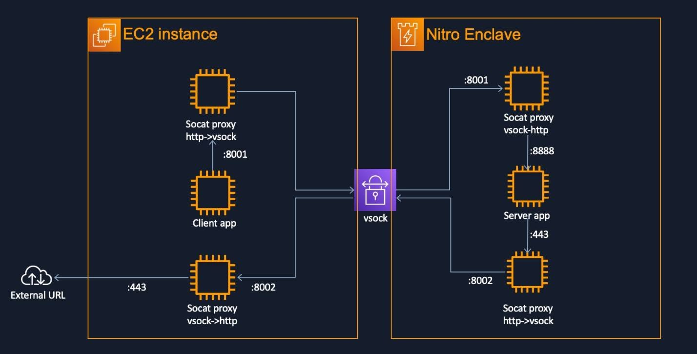
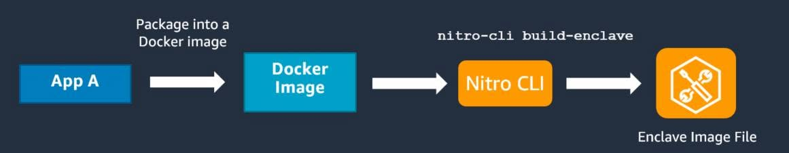

## Chạy ứng dụng web truyền thống trên AWS Nitro Enclaves mà không cần sửa mã nguồn

Chào anh em AWS Study Group VN!

Trong quá trình tìm hiểu về AWS Nitro Enclaves, mình có đọc được một bài viết khá thú vị từ AWS chia sẻ về cách đưa các ứng dụng Web truyền thống vào môi trường Enclave mà gần như không cần chỉnh sửa mã nguồn của ứng dụng.

Do tài liệu gốc được đăng trên AWS China nên trong quá trình tìm hiểu mình vừa đọc, vừa dịch và tổng hợp lại những ý chính. Nếu có điểm nào chưa chính xác hoặc còn thiếu sót thì rất mong anh em góp ý thêm.

### Nitro Enclaves là gì?

Nitro Enclaves là một môi trường tính toán biệt lập được tạo ra từ EC2 Instance thông qua AWS Nitro Hypervisor.

Mục tiêu chính của dịch vụ này là xử lý các dữ liệu có độ nhạy cảm cao như:

- Khóa mã hóa (Encryption Keys)
- Dữ liệu tài chính
- Dữ liệu y tế
- Thông tin định danh người dùng
- Các tác vụ cần mức độ bảo mật cao

Điểm đặc biệt của Nitro Enclaves là môi trường này được cô lập gần như hoàn toàn:

- Không có địa chỉ IP
- Không có kết nối Internet
- Không thể SSH trực tiếp
- Không có bộ nhớ lưu trữ lâu dài (Persistent Storage)

Mọi giao tiếp với Enclave đều phải thông qua VSOCK và Parent EC2 Instance. Đây cũng chính là điểm tạo nên mức độ bảo mật cao của Nitro Enclaves, nhưng đồng thời cũng khiến việc đưa các ứng dụng hiện có vào Enclave trở nên khó khăn hơn.

### Khó khăn khi di chuyển ứng dụng web

Hầu hết các ứng dụng Web hiện nay đều hoạt động dựa trên giao thức TCP/IP thông qua HTTP hoặc HTTPS. Trong khi đó, Nitro Enclaves lại không hỗ trợ giao tiếp mạng theo cách thông thường mà chỉ sử dụng VSOCK.

Nếu triển khai trực tiếp, lập trình viên sẽ phải sửa khá nhiều phần mã nguồn để chuyển toàn bộ cơ chế giao tiếp từ TCP/IP sang VSOCK. Với các hệ thống đã vận hành ổn định hoặc các ứng dụng lâu năm, đây là công việc vừa tốn thời gian vừa tiềm ẩn nhiều rủi ro vì rất dễ ảnh hưởng đến logic sẵn có của ứng dụng.

### Giải pháp AWS đề xuất

Điểm mình thấy khá hay trong bài viết là AWS đề xuất sử dụng **SOCAT** như một lớp proxy trung gian để chuyển đổi giữa HTTP và VSOCK.

Mô hình sẽ gồm hai proxy:

- Proxy chạy trên Parent EC2 nhận các kết nối HTTP từ bên ngoài rồi chuyển thành VSOCK để gửi vào Enclave.
- Proxy chạy trong Enclave nhận VSOCK rồi chuyển ngược lại thành HTTP để ứng dụng xử lý.

Ở chiều ngược lại cũng tương tự. Nếu ứng dụng bên trong Enclave cần kết nối ra ngoài, proxy sẽ chuyển lưu lượng từ HTTP sang VSOCK để Parent EC2 thay mặt Enclave thực hiện việc truy cập mạng.

Nhờ cách làm này, ứng dụng vẫn có thể hoạt động gần giống như đang chạy trên một máy chủ Linux thông thường mà gần như không cần chỉnh sửa logic xử lý.

### Quy trình triển khai

Theo bài viết của AWS, quy trình triển khai có thể tóm tắt như sau:

1. Cài đặt Nitro Enclaves CLI và Developer Tools.
2. Build ứng dụng thành Docker Image.
3. Chuyển Docker Image sang định dạng EIF (Enclave Image File).
4. Khởi chạy Enclave bằng Nitro CLI.
5. Triển khai hai proxy SOCAT ở Parent EC2 và Enclave.
6. Truy cập ứng dụng thông qua Parent Instance, mọi lưu lượng sẽ được chuyển tiếp vào Enclave thông qua VSOCK.

### Điều mình thấy thú vị

Điểm mình đánh giá cao ở cách triển khai này là AWS không yêu cầu lập trình viên phải viết lại toàn bộ ứng dụng chỉ vì khác cơ chế giao tiếp. Thay vào đó, việc bổ sung thêm một lớp proxy giúp tận dụng được các ứng dụng hiện có, giảm đáng kể chi phí và thời gian khi muốn đưa hệ thống vào môi trường bảo mật cao hơn.

Đây cũng là một ví dụ khá hay về việc kết hợp các công cụ mã nguồn mở như SOCAT với các dịch vụ của AWS để giải quyết bài toán tương thích mà vẫn đảm bảo tính cô lập và bảo mật của Nitro Enclaves.

Tất nhiên, mô hình này cũng có một số điểm cần lưu ý như hiệu năng của lớp proxy, việc giám sát lưu lượng hay cách thiết kế kiến trúc tổng thể để phù hợp với từng hệ thống. Vì vậy, trước khi áp dụng vào môi trường thực tế vẫn cần đánh giá kỹ theo nhu cầu của từng dự án.

### Tổng kết

Theo mình, Nitro Enclaves là một dịch vụ khá thú vị của AWS nếu anh em đang tìm hiểu về bảo mật hoặc xây dựng các hệ thống xử lý dữ liệu nhạy cảm.

Bài viết này cũng cho thấy một hướng tiếp cận thực tế: thay vì chỉnh sửa toàn bộ ứng dụng để thích nghi với Enclave, có thể tận dụng lớp chuyển đổi giao thức để giảm đáng kể công sức di chuyển mà vẫn giữ được mức độ bảo mật mà Nitro Enclaves mang lại.

Đây là lần đầu mình tìm hiểu và tổng hợp về chủ đề này. Nếu trong quá trình dịch hoặc nghiên cứu còn thiếu sót, rất mong anh em góp ý để mình hoàn thiện hơn.

### Nguồn tham khảo

- AWS China Blog – Running Traditional Web Application Migration Practices in AWS Nitro Enclaves (tài liệu gốc bằng tiếng Trung): <https://aws.amazon.com/cn/blogs/china/running-traditional-web-application-migration-practices-in-aws-nitro-enclaves/>
