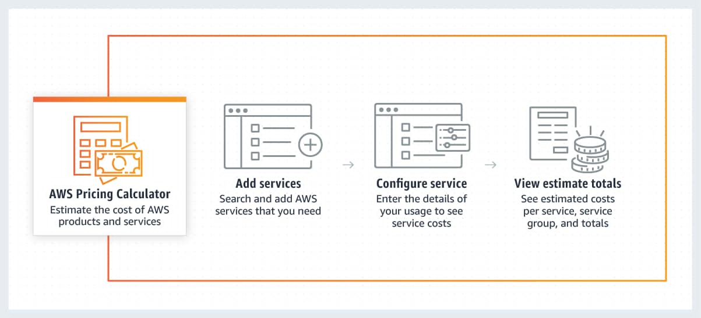
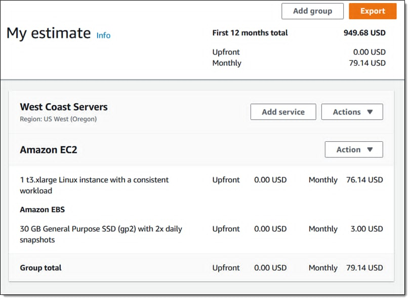

## AWS Pricing Calculator – Ước tính chi phí trước khi triển khai

Chào anh em AWS Study Group VN!

Trong quá trình học và thực hành AWS, mình nhận ra một câu hỏi xuất hiện rất thường xuyên: *"Triển khai một dịch vụ sẽ tốn bao nhiêu tiền mỗi tháng?"*

Thay vì tạo tài nguyên thật rồi chờ hóa đơn cuối tháng, AWS cung cấp một công cụ miễn phí giúp chúng ta ước tính chi phí trước khi triển khai, đó là **AWS Pricing Calculator**.

Trong bài viết này, mình sẽ chia sẻ cách sử dụng AWS Pricing Calculator để tính chi phí cho một EC2 cơ bản.

### 1. AWS Pricing Calculator là gì?

AWS Pricing Calculator là công cụ cho phép bạn tạo các kịch bản cho khối lượng công việc mới hoặc thay đổi khối lượng công việc hiện có để ước tính chi phí.

### 2. Vì sao nên sử dụng AWS Pricing Calculator?

Theo mình, công cụ này hữu ích trong các trường hợp:

- Ước tính được chi phí trước khi triển khai hệ thống.
- Lập kế hoạch ngân sách cho dự án.
- Chia sẻ estimate với khách hàng hoặc thành viên trong nhóm.

### 3. Quy trình sử dụng AWS Pricing Calculator

Theo bài viết của AWS, quy trình sử dụng có thể tóm tắt như sau:

1. Tạo Estimate.
2. Chọn dịch vụ cần tính chi phí.
3. Nhập các thông số.
4. Estimate sẽ được hiển thị tại trang **My Estimate**.

Ví dụ với một estimate cho EC2 cơ bản, sau khi nhập thông số, trang My Estimate sẽ hiển thị chi tiết chi phí theo từng dịch vụ, nhóm dịch vụ và tổng chi phí.

### 4. Một số lưu ý

AWS Pricing Calculator chỉ cung cấp chi phí ước tính dựa trên các thông số được nhập. Chi phí thực tế có thể thay đổi tùy thuộc vào:

- Mức sử dụng thực tế.
- Lưu lượng mạng phát sinh.
- Các dịch vụ bổ sung.
- Thay đổi về giá dịch vụ theo Region.

Do đó, kết quả từ Pricing Calculator nên được xem như một công cụ hỗ trợ lập kế hoạch chi phí hơn là con số tuyệt đối.

### 5. Tổng kết

Theo mình, AWS Pricing Calculator là một công cụ hữu ích đối với bất kỳ ai đang học hoặc làm việc với AWS.

Thay vì triển khai tài nguyên rồi mới kiểm tra chi phí, chúng ta có thể chủ động ước tính trước ngân sách, so sánh các lựa chọn và đưa ra quyết định phù hợp ngay từ giai đoạn thiết kế hệ thống.

Nếu anh em đã từng sử dụng AWS Pricing Calculator hoặc có kinh nghiệm về tối ưu chi phí trên AWS thì có thể chia sẻ thêm ở phần bình luận nhé.

### Nguồn tham khảo

- AWS Cost Management – AWS Pricing Calculator: <https://aws.amazon.com/vi/aws-cost-management/aws-pricing-calculator/>
