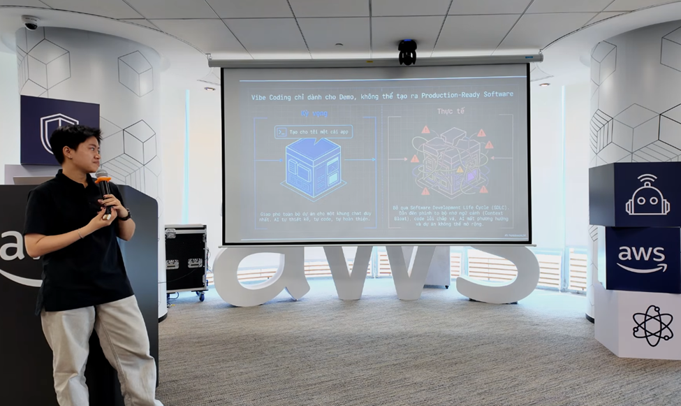

&emsp;**Event Name:** FCAJ Community Day

&emsp;**Date & Time:** May 9, 2026

&emsp;**Location:** Offline Meetup (organized by AWS Study Group)

&emsp;**Role:** Attendee

&emsp;**Brief description of the event’s content:**
The event featured four deep-dive sessions:
* Analyzing the brain's Dopamine mechanism to "hack" study motivation and turn learning into a consistent habit.
* A guide to Ultimate Prompt Engineering using a 7-part structure to optimize LLM interactions, alongside an AWS Serverless architecture demo.
* Career mindset in the AI era: The critical importance of foundational knowledge and integrity.
* Introduction to the BMAD method—breaking down AI-assisted development projects to prevent hallucination caused by context overload.

&emsp;**Proof of participation :** 

&emsp;**Outcomes or value gained:**
* **Technical Mindset:** Realized that AI is an amplifier of core capabilities. Learned the methodology of breaking down complex problems into manageable modules.
* **Soft Skills:** Gained a profound understanding of workplace integrity, the habit of questioning everything, and focusing on long-term career development rather than short-term gains.