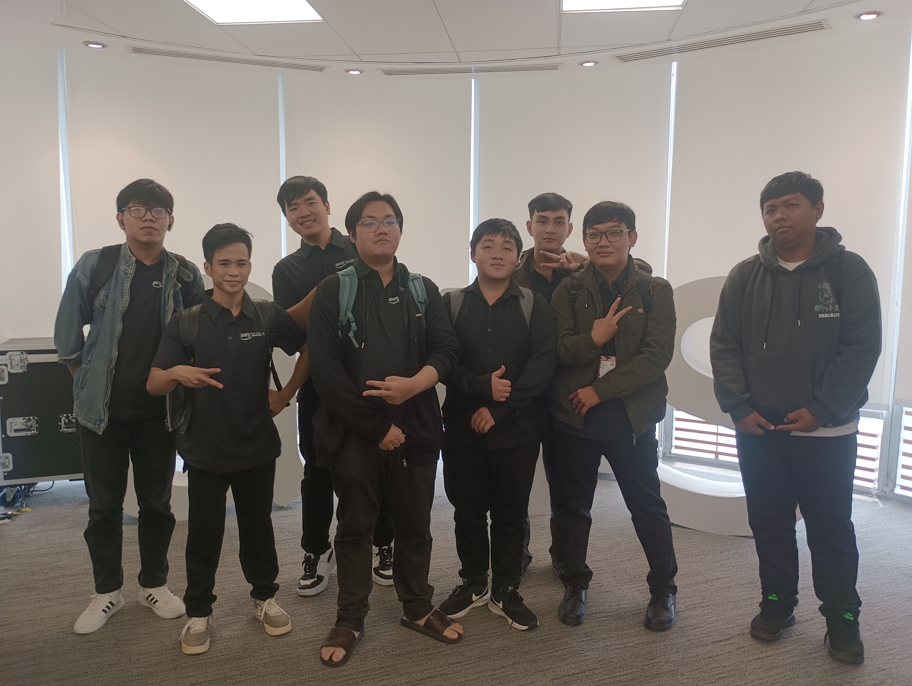

&emsp;**Tên sự kiện:** FCAJ Community Day

&emsp;**Thời gian:** 09/05/2026

&emsp;**Địa điểm:** Buổi Offline Meetup (do AWS Study Group tổ chức)

&emsp;**Vai trò trong sự kiện:** Người tham dự

&emsp;**Mô tả ngắn gọn nội dung và hoạt động chính:**
Sự kiện xoay quanh 4 phiên trình bày chuyên sâu:
* Phân tích cơ chế tiết Dopamine của não bộ để "hack" động lực học tập, biến việc học thành thói quen liên tục.
* Hướng dẫn kỹ thuật Ultimate Prompt Engineering với cấu trúc 7 phần để tối ưu hóa tương tác với LLM, kèm demo kiến trúc Serverless trên AWS.
* Chia sẻ về Mindset đi làm trong kỷ nguyên AI: Tầm quan trọng của kiến thức nền tảng (Foundation) và tính liêm chính (Integrity).
* Giới thiệu phương pháp BMAD – chia nhỏ quy trình phát triển dự án với AI để tránh hiện tượng hallucination do nhồi nhét quá nhiều context.

&emsp;**Hình ảnh chứng minh:** 

&emsp;**Kết quả hoặc giá trị đạt được:**
* **Về tư duy công nghệ:** Nhận ra AI chỉ là công cụ khuếch đại (Amplify) năng lực cốt lõi. Nắm được tư duy chia nhỏ bài toán phức tạp thành các module nhỏ để dễ kiểm soát.
* **Về kỹ năng mềm:** Hiểu sâu sắc hơn về tính liêm chính trong công việc, luôn tự vấn (Question everything) và nhìn nhận sự nghiệp theo hướng dài hạn thay vì chỉ tập trung vào lợi ích trước mắt.