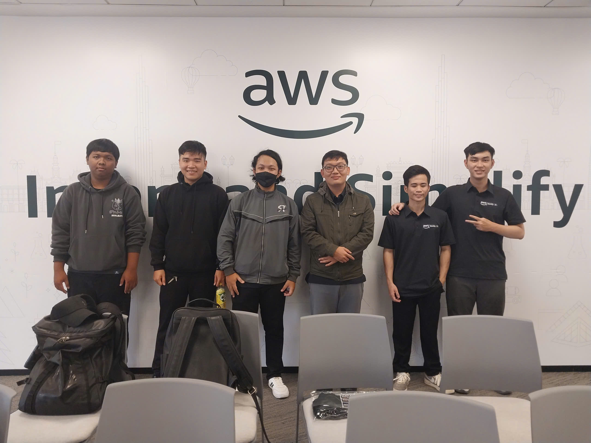
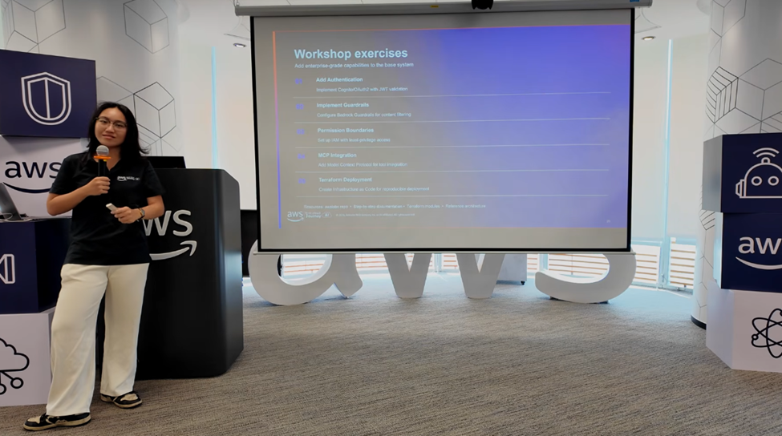

&emsp;**Event Name:** FCAJ Community Day

&emsp;**Date & Time:** May 23, 2026

&emsp;**Location:** Offline Meetup (organized by AWS Study Group)

&emsp;**Role:** Attendee

&emsp;**Brief description of the event’s content:**
The event delved into infrastructure management, hiring trends, and security:
* Forecasting market shifts towards AI-optimizing Software Engineering and Platform Engineering.
* Analyzing real-world hiring standards: Large enterprises still prioritize core Backend skills, secure data encryption, and safe storage.
* Guidelines on setting permissions and securing autonomous AI Agents (via MCP).
* Practical insights into managing infrastructure automatically using Terraform (Infrastructure as Code) for version control and system reproduction.

&emsp;**Proof of participation :** 

&emsp;**Outcomes or value gained:**
* **Technical Knowledge:** Grasped the value of Terraform in infrastructure automation and the necessity of security layers when integrating AI Agents into enterprise environments.
* **Professional Orientation:** The strict standards on encryption and data safety reinforced the focus on foundational system skills. It became clear that system design must inherently prioritize security and reliability from the ground up.