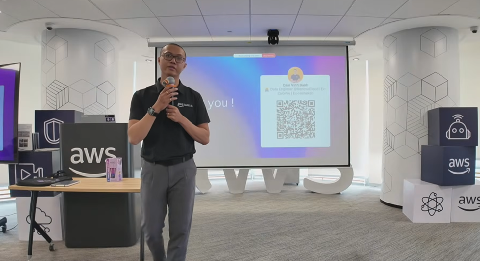

&emsp;**Event Name:** AWS: Enterprise Cloud Architectures and Industry Application

&emsp;**Date & Time:** July 4, 2026

&emsp;**Location:** Study Tour at the AWS Office, in collaboration with AWS FCAJ.

&emsp;**Role:** Attendee

&emsp;**Brief description of the event’s content:**
A practical sharing session by AWS experts focusing on Cloud architecture and the job market landscape:
* Revealed that 90% of high-quality roles (including those at AWS) are filled through internal referrals rather than public job postings.
* Analyzed case studies on strict enterprise standards (e.g., an intern failing due to a lack of foundational Kubernetes/K8S knowledge).
* Career development mindset: Enhancing personal visibility, engaging in cross-functional teamwork, and maintaining consistent action.

&emsp;**Proof of participation :** 

&emsp;**Outcomes or value gained:**
* **Systems Perspective:** Through the K8S case study, it became evident that establishing information safety policies is inseparable from the underlying Cloud infrastructure—a pivotal concept for building robust defense mechanisms.
* **Professional Networking:** The technology sector heavily relies on trust. Learning that "90% of jobs come from referrals" serves as a strong catalyst to proactively build networks within communities (like FCAJ) to tap into the "hidden job market."